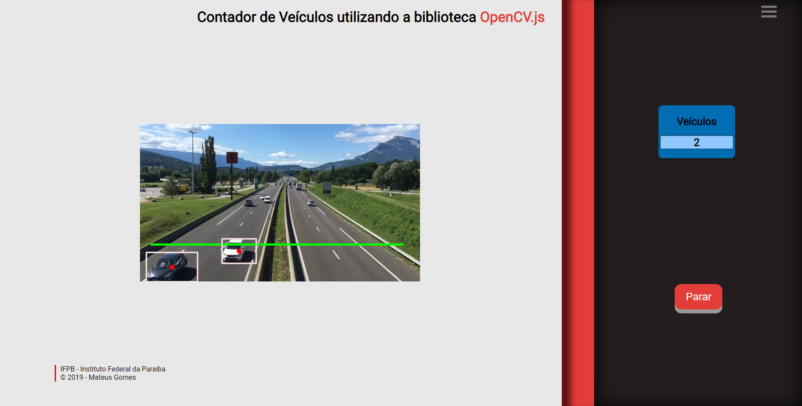

# Contador-de-Veiculos

> OpenCV.js + JavaScript

Projeto desenvolvido na disciplina Processamento Digital de Sinais no 6º Período do curso de Bacharelado em Engenharia Elétrica ofertado pelo IFPB Campus João Pessoa.

## Funcionamento
O projeto consiste em contar a quantidade de carros através da visão computacional, utilizando a biblioteca OpenCV.js. 

